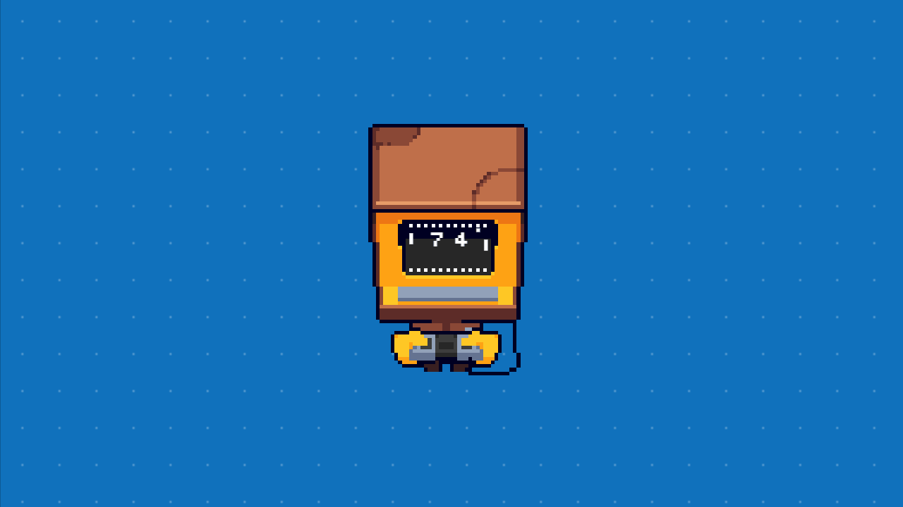

Hi there, I'm Björn Hjorth 👋

I like combining the web and game development, if you like what you see please do not be a stranger and say "Hi" on Twitter [@browsermage](https://twitter.com/browsermage)


<a href="https://browsermage.github.io/pong-typescript-game-development/">Try live demo⚡️</a>
·
<a href="https://github.com/browsermage/pong-typescript-game-development/issues">Report Bug</a>

<div align="center">
   
</div>

<!-- ABOUT -->
## About The Project

First I want to thank Warren for letting me use the pixel art for this demo, thank you kindly 💝 please check out more of the fantastic pixel art at Warrens Twitter [@WoostarsPixels](https://twitter.com/WoostarsPixels)

This project is filled with some excellent coding practices and some not so great 😅

For more examples of patterns and extraordinary approaches in game programming please take a look at the book [Game programming patterns](https://gameprogrammingpatterns.com/)

<!-- PREREQUISITES -->
## Prerequisites

* Node
* Npm

<!-- STARTING -->
## Getting started 

1. Clone the repo
   ```sh
   git clone https://github.com/browsermage/pong-typescript-game-development.git
   ```
2. Move to the new directory
    ```sh
    cd pong-typescript-game-development
    ```
3. Start up the development environment
   ```sh
   npm install
   ```
4. Start up the development environment
   ```sh
   npm run dev 
   ```
<!-- CONTACT -->
## Contact

Björn Hjorth - [@colorsofcode](https://twitter.com/browsermage)

<!-- LICENSE -->
## License

The code is distributed under the MIT License. See `LICENSE` for more information.
The pixel art spritesheet is distributed under the 

<!-- ACKKNOWLEDGE -->
## Acknowledgments

[@WoostarsPixels](https://twitter.com/WoostarsPixels)

[Game programming patterns](https://gameprogrammingpatterns.com/)
